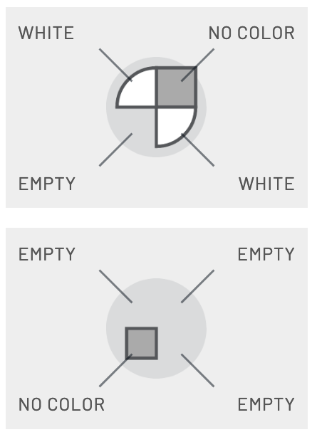
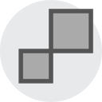
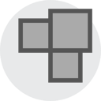
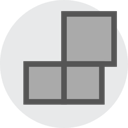
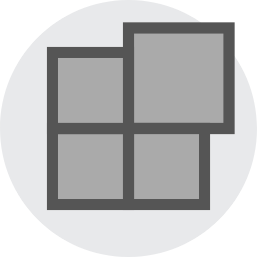
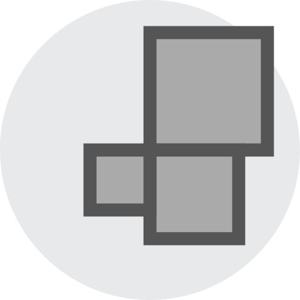
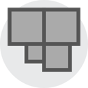

# How many shapez.io shapes are possible?

## Introduction

[shapez.io](https://shapez.io/) is a game by @tobspr where the player builds various shapes. A shape is composed of up to 4 layers, and each layer of 4 quadrants.

Shapes naturally found in the game have only one layer, which is full. All other shapes are constructed from these by the player, by:

- rotating
- cutting
- stacking
- colouring

Some shapes are **buildable**: The player can produce them in-game. Others are **impossible**: There is no sequence of operations resulting in that shape. For example, an entirely floating layer with nothing underneath it is impossible.

**How many buildable shapes are there?**

## Warning

The stacker rules have been changed in the alpha. This calculation uses the new rules, and does not apply to the current (as of 2020-09-06) production version.

## Method

### Idea

For each of the 16 quadrants in a shape, the quadrant may be empty or present. If present, then there are 32 possibilities: 4 shape-types (rectangle, circle, square, windmill) times 8 colours (uncoloured, red, green, blue, cyan, purple, yellow, white).

The buildability of a shape does *not* depend on this choice, only on which quadrants are present vs empty. That lets us simplify the problem by considering only configurations of present/empty quadrants without other info. I call these **configurations**. (This is not a standard term.)

### Finding buildable configurations

To determine which configurations are buildable, we start from the naturally occurring configuration (four quadrants on bottom layer, nothing else) and apply the various operations that can be done in-game. When no new configurations are produced, we're done.

Colour is irrelevant, so we have three operations:

- Cut a configuration (vertically)
- Rotate a configuration by a quarter turn
- Stack a configuration on top of another configuration

That last operation makes the search very long, because we need to stack everything on top of everything else. That makes the run time quadratic, or in technical terms, "super nasty".

### Counting shapes

For each configuration, count how many quadrants are present. A configuration with N present quadrants contributes 32 possibilities for each present quadrant times 1 possibility for each empty quadrant = 32^N possibilities.

## Results

There are **1977980178440479560583296** buildable shapes. They amount to 99.999746% of all 33^16 shapes.

48432 configurations out of all 65536 are buildable (73.9%). Configurations with more quadrants are more often buildable (13 quadrants and up always are) and contribute far more shapes, so impossible configurations correspond to relatively few shapes.

## What are the impossible configurations?

Examining the list of buildable and impossible configurations, there are 7 fundamental impossible configurations. A shape is impossible if and only if it contains one of these shapes. They are:

1. Fully empty layer
2. 
3. 
4. 
5. 
6. 
7. 
